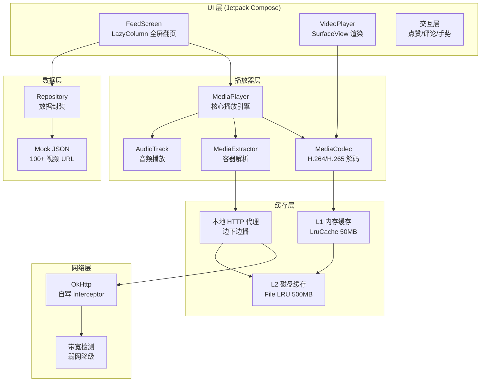

# 自研短视频 Feed

一个抖音风格的上下滑短视频信息流 Android 应用，基于 MediaCodec 底层 API 自研视频解码渲染管线，禁用 ExoPlayer/IjkPlayer 等高层封装。

## 架构



## 运行指南

### 环境要求

- Android Studio Ladybug (2024.2) 或更高版本
- JDK 17
- Android SDK: compileSdk 34, minSdk 26
- 真机或模拟器（推荐 API 26+）

### 快速开始

```bash
# 1. 克隆仓库
git clone https://github.com/Jtian-t/vedio_feed.git
cd vedio_feed

# 2. 用 Android Studio 打开项目
# File → Open → 选择 vedio_feed 目录

# 3. 等待 Gradle 同步完成

# 4. 连接设备或启动模拟器

# 5. 点击 Run ▶ 运行到设备
```

### 常见问题

- **Gradle 同步慢**: 检查网络代理配置，或使用国内镜像源
- **设备兼容性**: 最低支持 API 26 (Android 8.0)

## 功能清单

### 基础功能

- [ ] A1 上下滑无限视频流 — 单页全屏，滑动顺滑，首帧 < 800ms
- [ ] A2 视频播放/暂停/进度条 — 点击屏幕暂停，长按倍速
- [ ] A3 视频解码与渲染 — MediaCodec + SurfaceView，禁用 ExoPlayer
- [ ] A4 简单点赞/评论 UI — 本地状态即可
- [ ] A5 视频列表数据 — mock JSON (100+ URL)

### 进阶功能

- [ ] A6 智能预加载 — 自定义 N 个视频预加载策略
- [ ] A7 三级缓存 — 内存 + 磁盘 + 网络，LRU 淘汰，断点续传
- [ ] A8 边下边播 — HTTP Range + 本地代理
- [ ] A9 列表 1 万条流畅滑动 — Systrace/Perfetto 截图证明 60fps
- [ ] A10 弱网降级 — 检测带宽自动切换清晰度
- [ ] A11 进入后台释放资源 — onPause 释放 Codec，onResume 快速恢复

## 验收标准

| 项目 | 标准 |
|---|---|
| 首帧时间 | 中端机（骁龙 778G 级）< 800ms |
| 滑动帧率 | 95% 帧 >= 55fps，提交 Perfetto 报告 |
| 内存峰值 | 单视频播放期间 < 200MB |
| 崩溃率 | 200 次自动滑动测试，0 崩溃 |
| 缓存命中率 | 重复观看场景 >= 90% |

## 交付文档

- [AI_USAGE.md](AI_USAGE.md) — AI 辅助方案采纳/未采纳记录
- [DECISIONS.md](DECISIONS.md) — 关键架构决策记录 (ADR 格式)
- [BUGFIX.md](BUGFIX.md) — 踩坑排查记录
- [PERFORMANCE.md](PERFORMANCE.md) — 性能报告与 Demo 视频指引

## 技术栈

| 类别 | 技术 |
|---|---|
| 语言 | Kotlin |
| UI | Jetpack Compose |
| 异步 | Coroutines + Flow |
| 网络 | OkHttp（裸用，自写 Interceptor）|
| 播放器 | 自研 MediaCodec + SurfaceView |
| 性能工具 | Android Studio Profiler、Perfetto、Systrace |
